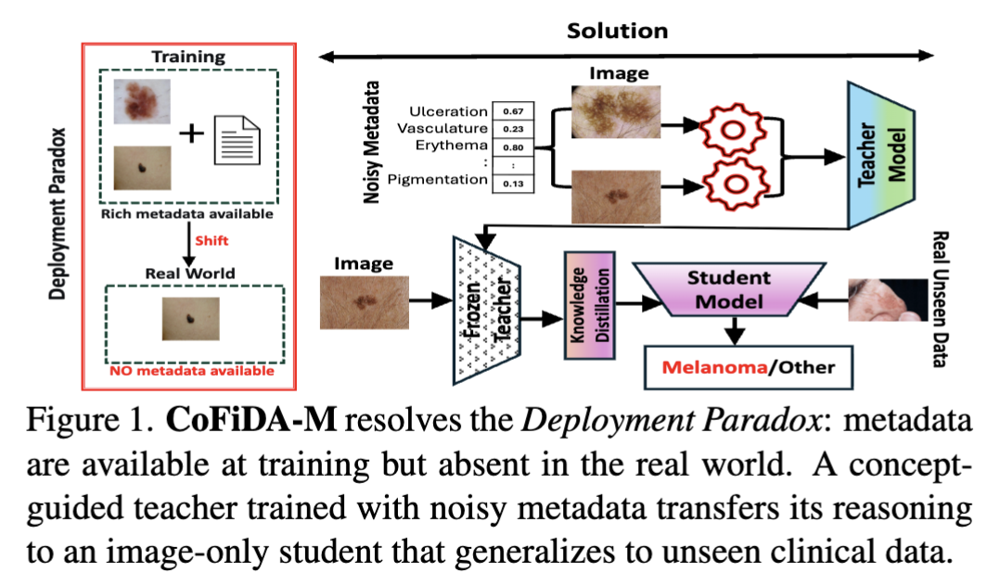

# CVPR'26

# CoFiDA-M: Concept-Aware Feature Modulation for Cross-Domain Adaptation with Image-Only Inference 
### Authors: Nurjahan Sultana, Moi Hoon Yap, Xinqi Fan, and Wenqi Lu

## CoFiDA-M Architecture

## Abstract
Models for AI-based skin cancer screening suffer a severe performance drop when shifting from expert dermoscopic (source) images to consumer-grade clinical (target) images, hindering real-world deployment. Existing domain adaptation methods often ignore crucial semantic invariants, such as clinical concepts. While new foundation models like MONET can provide this semantic information as dense, probabilistic scores, this metadata is unavailable at test time, creating a deployment paradox for practical image-only screening tools. We address this gap by proposing CoFiDA-M, a privileged information framework that learns from concepts at training time but deploys as an image-only model. Our method trains a teacher network that uses MONET concept probabilities to guide a FiLM modulator, transforming visual features into a semantically "edited" feature space. A lightweight, image-only student is then trained to reproduce this edited representation, not just the teacher's final predictions. This distillation "bakes" the clinical reasoning into the student's weights. On a challenging multi-dataset benchmark, our image-only student significantly outperforms state-of-the-art approaches, especially in melanoma recall. Our work provides a practical and generalizable framework for leveraging noisy, probabilistic metadata as privileged information, demonstrating strong cross-dataset robustness and potential for real-world deployment beyond dermatology.

## Problem and Proposed Solution

  

## Dataset
This work was evaluated on eight public skin lesion datasets for binary classification between melanoma and other lesions.

## Dataset Links

* [MILK10K dermoscopic](https://api.isic-archive.com/doi/milk10k/)
* [MILK10K clinical](https://api.isic-archive.com/doi/milk10k/)
* [Derm7pt dermoscopic](https://derm.cs.sfu.ca/Welcome.html)
* [Derm7pt clinical](https://derm.cs.sfu.ca/Welcome.html)
* [MIDAS dermoscopic](https://aimi.stanford.edu/datasets/mra-midas-Multimodal-Image-Dataset-for-AI-based-Skin-Cancer)
* [MIDAS clinical](https://aimi.stanford.edu/datasets/mra-midas-Multimodal-Image-Dataset-for-AI-based-Skin-Cancer)
* [HAM10000](https://www.nature.com/articles/sdata2018161)
* [Fitzpatrick17k](https://github.com/mattgroh/fitzpatrick17k)

## Baseline
CoFiDA was compared against 14 baseline methods in 4 categories and a source only setting.

## Evaluation
* AUROC (main)
* Melanoma recall (main)
* Balanced accuracy (supp)

## Qualitative Analysis
* Confidence gap comparison (main)
* Inference speed comparison (main)
* t-SNE of image only student features (main)
* Feature editing maps with Grad-CAM before and after FiLM editing (main)
* Feature space transformation analysis (main)
* MONET concept influence visualisation (main)
* Attention distribution analysis (main)
* Qualitative validation of implicit concept learning and student teacher alignment (main)
* Extended balanced accuracy statistical analysis (supp)
* Detailed ablation visualisation on MONET concept subsets (supp)
* Distillation feature alignment weight analysis (supp)

Code: Coming Soon...

## Contact

For questions or further discussion, please contact: nurjahan.sultana@stu.mmu.ac.uk
